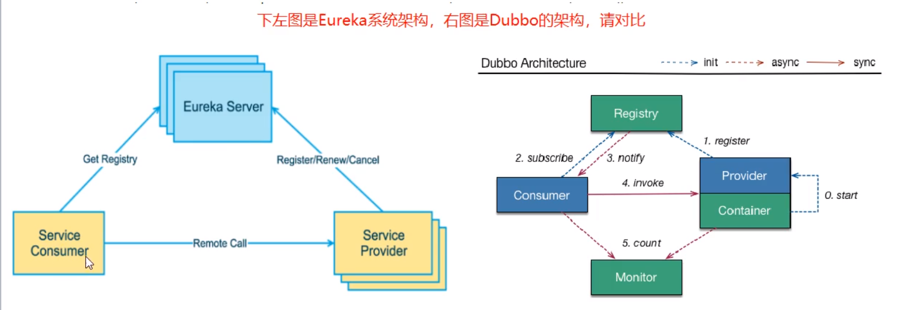
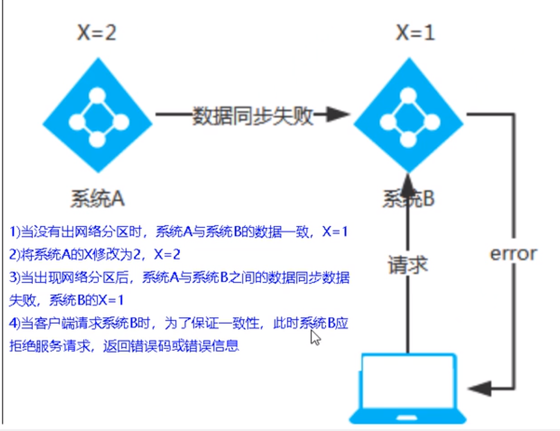
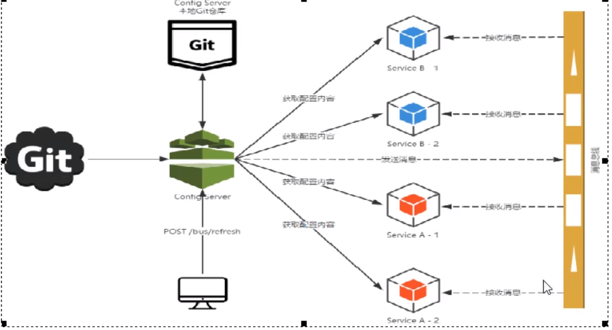

# 1、如何学习？

微服务架构的4个核心问题？

​	1. 服务很多，客户端怎么访问？

 	2. 这么多服务，服务之间如何通信
 	3. 这么多服务，如何治理？
 	4. 服务挂了怎么办？

解决方案：

​	SpringCloud  是一个生态！ 是一个解决微服务架构的思想

​	1、 Spring Cloud NetFlix	一站式解决方案

​		api网关，zuul组件

​		feign	-- httpClient --- Http通信方式，同步，阻塞

​		服务注册发现：Euraka

​		熔断机制： Hystrix

​	。。。

​	2、	Apache Dubbo Zookeeper	半自动，需要整合别人的

​		API：没有，第三方组件

​		Dubbo

​		Zookeeper

​		没有，借助Hystrix

​	3、Spring Cloud Alibaba 一站式解决方案！更简单

**万变不离其宗：**

​	1. API网关

 	2. HTTP，RPC
 	3. 注册与发现
 	4. 熔断机制


如果基于这些问题，你可以研发出一套解决方案，也可以叫做SpringCloud

为什么要解决这些问题？ 本质：网络是不可靠的

# 2、微服务概述

## 	1.微服务

​		微服务的核心就是将传统的一站式服务，根据业务拆分一个一个的服务，彻底地去解耦，每个微服务提供的那个业务功能的服务，一个服务做一件事，从技术角度看就是一种小而独立的处理过程，类似进程的概念，能够自行单独启动和销毁，拥有自己独立的数据库


# 3、参考文档

参考：https://springcloud.cc/spring-cloud-netflix.html 

中文API文档：https://springcloud.cc/spring-cloud-dalston.html SpringCloud中国社区 http://springcloud.cn/ 

SpringCloud中文网  https://springcloud.cc

spring cloud和boot的版本对应：


本次开发环境：


# 4、微服务provider模块编写的步骤

1、建moudle

2、导入依赖

3、修改yml

4、主启动类

5、编写业务

​	1）pojo

​	2）dao

​	3）service

​	4）controller

# 5、RestTemplate

1、是什么？

​	RestTemplate提供了多种便捷访问远程http服务的方法

​	是一种简单便捷的访问restful服务模板类，是spring提供的访问restful服务的**客户端模板工具集**

2、怎么用？

​	需要将其实例交给spring管理，然后再代码注入使用

​	参数格式：(url, requestMap, ResponseBean.class)这三个参数分别代表：REST请求地址、请求参数、HTTP响应转换被转换成的对象类型。

3、常用方法

​		getForObject：返回对象为响应体中转为成的对象，可以理解成json串

​		getForEntity：返回对象为ResponseEntity对象，包含响应中的一些重要信息，响应头，状态码，响应体......

# 6、微服务的建立步骤

1）建module

2）导依赖

3）配置yml

4）主启动（开启功能）

5）业务	

# 7、服务注册中心

1、为什么要引入服务注册中心？

​	对微服务进行统一调度、协调、管理

## 5.1Eureka服务注册与发现

### Eureka的基础知识

​	1、什么是服务治理？

​	Spring Cloud封装了Netflix公司开发的Eureka模块来实现服务治理

​	在传统的rpc远程调用框架中，管理每个服务与服务之间依赖关系比较复杂,管理比较复杂，所以需要使用服务治理，**管理服务于**

**服务之间依赖关系**，可以实现服务调用、负载均衡、容错等,实现服务发现与注册。

​	2、什么是服务注册与发现

​		Eureka采用了CS的设计架构，Eureka Server作为服务注册功能的服务器，它是服务注册中心。而系统中的其他微服务,使用**Eureka的客户端连接到Eureka Server并****维持心跳连接**。这样系统的维护人员就可以通过Eureka Server 来监控系统中各个微服务是否正常运行。
​		在服务注册与发现中，有一个注册中心。当服务器启动的时候，**会把当前自己服务器的信息**比如服务地址通讯地址等以别名方式**注册到注册中心上。另一方(消费者|服务提供者)，以该别名的方式去注册中心上获取到实际的服务通讯地址,然后再实现本地RPC调用.RPC远程调用框架核心设计思想:在于注册中心,因为使用注册中心管理每个服务与服务之间的一个依赖关系(服务治理概念)。在任何rpc远程框架中，都会有一个注册中心(**存放服务地址相关信息**(接口地址))



### 


### Eureka集群原理

问题：微服务远程调用最核心的是什么？

​		==高可用==，若你的注册中心只有一个，一旦发生故障，则会导致整个微服务环境不可用，因此

解决办法：搭建eureka集群，实现**负载均衡和故障容错**

集群注册的原理：==**相互守望，互相注册**==


### Eeureka的自我保护机制

1、什么是eureka的自我保护机制？

​	当某个微服务不可用时，eureka不会将该微服务从注册中心剔除，会一直保留其注册信息，等待修复，**直到心跳恢复正常**，它自动退出自我保护模式。

2、为什么会有eureka的自我保护机制？

​	当注册中心不能及时收到某个微服务的心跳时，有两种情况：一是，该微服务已经宕机；二是，由于网络分区故障（网络延时）等情况。如果在第二种情况对其立即删除，会使丢失掉一个健康的服务实例。因此在开启自我保护机制的情况下，我们**假定所有不能及时发送心跳的服务实例都是第二种情况**，注册中心会一直等待该服务实例修复。

​	设计思想：

​		宁可保留错误的服务信息，也不盲目删除可能健康的服务实例。-好死不如赖活着

​		CAP中的AP

​		==**高可用**==

3、关闭eureka的自我保护机制

​	在eureka的服务端进行关闭

```yml
eureka:
	server:
        #关闭自我保护机制（默认是开启的）
        enable-self-preservation: false
        #修改指定时间内没有接受到心跳就将该服务剔除(默认是90秒)
        eviction-interval-timer-in-ms: 2000
```

​	 服务端测试关闭自我保护机制时可以配置

```yml
eureka:
	instance:
        #测试关闭eureka自我保护机制
        #客户端向服务端发送心跳的时间间隔
        lease-renewal-interval-in-seconds: 1
        #eureka服务端在最后一次收到心跳后等待的时间上限，单位为秒（90秒），超时将剔除服务
        lease-expiration-duration-in-seconds: 2
```

4、Eureka停更了怎么办？

​	老项目：停更不停用

​	替代：SpringCloud+Zookeeper


### actuator微服务信息完善

1、修改 主机名称：服务名称：端口

```yml
 instance:
    instance-id: payment8002  #修改服务实例主机名称的显示
```


2、鼠标移上去显示服务的ip和端口

```yml
 instance:
    instance-id: payment8002  #修改服务实例主机名称的显示
    prefer-ip-address: true  #显示服务实例的真实ip地址和端口
```


### 服务发现

​	获取注册中心的服务的信息，包括服务名，服务实例的ip......

使用：

​	1）注入一个DiscoveryClient，通过DiscoveryClient对象获取去注册中心的服务列表的信息。**注意导入的是接口的包**

```java
 @GetMapping("/payment/discovery")
    public Object discovery(){
        List<String> services = discoveryClient.getServices();
        for (String service : services) {
            log.info("*****service:" + service);
        }
        List<ServiceInstance> instances = discoveryClient.getInstances("CLOUD-PAYMENT-SERVER");
        for (ServiceInstance instance : instances) {
            log.info(instance.getHost()+":"+instance.getPort()+":"+instance.getUri());
        }
        return discoveryClient;
    }
```


​	2）在主启动类中添加

```java
@EnableDiscoveryClient //开启服务发现
```


## 5.2 Zookeeper注册中心

1、步骤

​	1）导入依赖，去除依赖冲突

```xml
 <!--使用zookeeper作为注册中心-->
        <dependency>
            <groupId>org.springframework.cloud</groupId>
            <artifactId>spring-cloud-starter-zookeeper-discovery</artifactId>
            <exclusions>
                <exclusion>
                    <groupId>org.apache.zookeeper</groupId>
                    <artifactId>zookeeper</artifactId>
                </exclusion>
            </exclusions>
        </dependency>
        <dependency>
            <groupId>org.apache.zookeeper</groupId>
            <artifactId>zookeeper</artifactId>
            <version>3.4.8</version>
            <exclusions>
                <exclusion>
                    <artifactId>slf4j-log4j12</artifactId>
                    <groupId>org.slf4j</groupId>
                </exclusion>
            </exclusions>
        </dependency>
```

​	2）在yml文件中配置

```yml
server:
  port: 8004

spring:
  application:
    name: cloud-payment-server #实例名 集群时保持一致
  cloud:
    zookeeper:
      connect-string: 192.168.182.130:2181 #zookeeper注册中心地址
```

​	3）在主启动类上添加@EnableDiscoveryClient

2、微服务在Zookeeper中是临时节点还是持久节点？

​	微服务在Zookeeper中时临时节点。当微服务没有在规定的时间内向Zookeeper发送心跳，那么Zookeeper会立即将其从服务列表中移除。重新恢复连接后会变成另一个结点。

​	和eureka的自我保护机制不同：

​		**==eureka侧重高可用==**

​		**==Zookeeper侧重数据一致性。==**


## 5.3 Consul注册中心

1、什么是Consul？

​	一套开源的分布式服务发现与配置管理系统，由HashiGorp公司用go语言开发。

2、Consul能干嘛？

​	1）服务发现	- 提供Http和DNS两种发现方式

​	2）健康检查

​	3）KV store	（键值对存储）

​	4）多数据中心

​	5）可视化界面

3、怎么用？

​	1）pom.xml

```xml
<!--使用zookeeper作为注册中心-->
        <dependency>
            <groupId>org.springframework.cloud</groupId>
            <artifactId>spring-cloud-starter-consul-discovery</artifactId>
        </dependency>
```

​	2）yml

```yml
server:
  port: 8006
spring:
  application:
    name: cloud-providerconsul-payment8006
  cloud:
    consul:
      host: localhost
      port: 8500
      discovery:
        service-name: ${spring.application.name}
```

​	3)主启动类上添加@EnableDiscoveryClient


## 5.4 三个注册中心的异同


CAP理论：

​	C：Consistency（强一致性）

​	A：Available（高可用性）

​	P：Partition tolerance（分区容错性）

​	**CAP理论关注的粒度是数据**，而不是整体系统设计的策略。


AP（eureka）：


CP（Zookeeper/Consul）：




AP、CP只能选择一个？

​	P，也就是在分布式系统中，不能避免系统之间出现数据不一致的情况。当数据同步失败的时候，我们保证数据一致，就不能对客户端提供服务；如果保证高可用，那么返回的就不是正确的数据，因此AC不能同时满足，我们可以根据需求来进行取舍。

# 8、服务调用

## 	8.1 Ribbon服务调用

​	1、Ribbon是什么？

​		Spring Cloud Ribbon是基于Netfix Ribbon实现的一套**客户端负载均衡**的工具。	

​		Ribbon是netfix发布的开源，它的主要功能时提供**客户端的软件负载均衡算法和服务调用**。简单的说，就是在配置文件中列出所有Load Balance（简称LB）后面的机器，Ribbon会自动按照某种规则（轮询，随机）去连接他们。我们很容易用Ribbon实现自定义的负载均衡算法。

​	2、Ribbon能干嘛？

​		主要做**负载均衡（LB）**。

​		什么是负载均衡？

​			将用户的请求均衡地平摊到多个服务上，从而达到系统的高可用。

​			负载均衡分类：

​					1）集中式的LB：即在消费方和服务方之间使用独立的LB设施（可以是硬件，如F5，也可以是软件，如nginx）。然后由设施负载将访问请求通过某种策略转发到提供方。

​					2）进程内LB：将LB逻辑集成到消费方，消费方通过注册中心获取可用的服务列表，然后自己再从这些地址中选择出一个合适的服务器

​		一句话：**负载均衡+RestTemplate调用**


​		**==Ribbon的本地负载均衡客户端 VS Nginx服务端负载均衡区别==**？

​			Ribbon属于进程内的LB，而Nginx属于集中式的LB。

​			Nginx的负载均衡是所有的请求都会打到nginx服务器上，然后由Nginx通过某些负载均衡算法再进行转发到具体的服务上进行处理，而Ribbon本地负载均衡，在调用服务接口时，会在获取注册中心的注册的服务列表后存储到本地jvm中，是在**发送请求的时候就通过某些算法直接发送到具体的服务器中**。从而在本地实现RPC远程调用。

​	


### 	**Ribbon的核心组件IRule**

​		1、IRule完成的主要功能是什么？

​			根据特定的算法从服务列表中选取一个要访问的服务。

​		2、IRule的实现：


com.netflix.loadbalancer.RoundRobinRule：轮询（默认）

com.netflix.loadbalancer.RandomRule：随机

com.netflix.loadbalancer.RetryRule：先根据RoundRobinRule的规则获取服务，如果获取失败，会在指定的时间内进行重试，获取可用服务

com.netflix.loadbalancer.WeightedResponseTimeRule：RoundRobinRule的扩展，响应月越快的实例选择权重越大，越容易被选择

com.netflix.loadbalancer.BestAvailableRule：会先过滤掉多次访问故障而处于断路器跳闸状态的服务，然后选择一个并发量最小的服务

com.netflix.loadbalancer.AvailabilityFilteringRule：先过滤掉故障实例，然后选择并发量小的实例

com.netflix.loadbalancer.ZoneAvoidanceRule：复合判断server所在区的性能和server可用性选择服务器

​	**3、Ribbon默认负载轮询算法原理，以及RoundRobinRule源码剖析**

​	内部有一个计数器，记录访问该服务的次数。

​	**==轮询负载算法的实现：每次实际调用服务的实例的下标	=	rest接口第几次请求次数	%	服务集群的数量==**，服务重启后从1开始计数

​	比如：List<ServiceInstances> instances = discoveryClient.getInstances("CLOUD-PAYMENT-SERVER");

​		instance[0] = 127.0.0.1:8001

​		instance[1] = 127.0.0.1:8002

​	

​	RoundleRobinRule源码解析：

```java
public class RoundRobinRule extends AbstractLoadBalancerRule {
	//原子整型，记录访问服务是第几次了
    private AtomicInteger nextServerCyclicCounter;
    private static final boolean AVAILABLE_ONLY_SERVERS = true;
    private static final boolean ALL_SERVERS = false;

    private static Logger log = LoggerFactory.getLogger(RoundRobinRule.class);

    public RoundRobinRule() {
        nextServerCyclicCounter = new AtomicInteger(0);
    }

    public RoundRobinRule(ILoadBalancer lb) {
        this();
        setLoadBalancer(lb);
    }
	//核心：返回一个此次请求选择的服务实例
    public Server choose(ILoadBalancer lb, Object key) {
        if (lb == null) {//判断负载均衡算法是否为空
            log.warn("no load balancer");
            return null;
        }

        Server server = null;//初始化一个服务对象，记录选择的服务实例
        int count = 0;//尝试获取的次数
        while (server == null && count++ < 10) {//循环尝试获取一个实例，最多允许重试10次
            List<Server> reachableServers = lb.getReachableServers();//获取可达的，活着的实例
            List<Server> allServers = lb.getAllServers();//获取该服务的所有实例
            int upCount = reachableServers.size();//获取健康的实例的数量
            int serverCount = allServers.size();//获取所有实例的数量

            if ((upCount == 0) || (serverCount == 0)) {//如果没有服务实例，或者都挂了，直接报错
                log.warn("No up servers available from load balancer: " + lb);
                return null;
            }
			//取模获取此次选择服务的下标，通过CAS保证多线程数据访问的正确性
            int nextServerIndex = incrementAndGetModulo(serverCount);
            server = allServers.get(nextServerIndex);//从所有实例中选择此次访问的实例，可能会访问到挂了的服务

            if (server == null) {
                /* Transient. */
                Thread.yield();
                continue;
            }

            if (server.isAlive() && (server.isReadyToServe())) {
                return (server);
            }

            // Next.
            server = null;
        }

        if (count >= 10) {
            log.warn("No available alive servers after 10 tries from load balancer: "
                    + lb);
        }
        return server;//经过一系列验证后，没有问题就返回
    }

    /**
     * Inspired by the implementation of {@link AtomicInteger#incrementAndGet()}.
     *
     * @param modulo The modulo to bound the value of the counter.
     * @return The next value.
     */
    private int incrementAndGetModulo(int modulo) {
        for (;;) {//多线程时，需要不断自旋，直到更新成功为止
            int current = nextServerCyclicCounter.get();
            int next = (current + 1) % modulo;
            if (nextServerCyclicCounter.compareAndSet(current, next))//CAS算法，轻量级同步机制
                return next;
        }
    }

    @Override
    public Server choose(Object key) {
        return choose(getLoadBalancer(), key);
    }

    @Override
    public void initWithNiwsConfig(IClientConfig clientConfig) {
    }
}
```

总结：RoundRobinRule是通过**取模算法加持CAS保证数据一致**来实现轮询负载。

​	4、自定义负载均衡算法

​	1）编写一个接口，接收服务的所有实例，返回此次选择访问的实例

​	2）实现接口，编写算法轮询返回服务的实例

```java
public interface LoadBalancer {
    ServiceInstance getInstance(List<ServiceInstance> serviceInstances);
}
//实现轮询
@Component
public class MyLB implements LoadBalancer {
    private AtomicInteger nums = new AtomicInteger(0);//第几次访问
    @Override
    public ServiceInstance getInstance(List<ServiceInstance> serviceInstances) {
        return serviceInstances.get(incrementNums() % serviceInstances.size());
    }
    public final Integer incrementNums(){
        int current;
        int next;
        do {
            current = nums.get();
            next = current > Integer.MAX_VALUE ? 0 :current + 1;
        }while (!nums.compareAndSet(current,next));
        System.out.println("****第"+next+"次调用");
        return next;
    }

}
//调用服务
 @GetMapping("/consumer/payment/lb")
    public String lb(){
        List<ServiceInstance> instances = discoveryClient.getInstances("CLOUD-PAYMENT-SERVER");
        ServiceInstance instance = loadBalancer.getInstance(instances);
        URI uri = instance.getUri();
//        String uri = instance.getUri().toString();
//        uri = uri + "/payment/lb";
        System.out.println(uri);
        return restTemplate.getForObject(uri + "/payment/lb",String.class);
    }
```

​	**==采坑：==**

​	在注册RestTemplate时忘记取消@LoadBalanced注解，导致调用服务时，找不到服务实例的错误。

​	原因：

​	加上@LoadBalanced后，调用服务的url应该是服务在注册中心的服务名，它会根据服务名获取所有的实例，然后对它们进行均匀的负载，restTemplate调用的url应该是这样：

```java
http://[服务名]/[调用的接口]
http://CLOUD-PAYMENT-SERVER/payment/get
```

​	而使用自定义的负载均衡算法，传入的url的格式是这样：

```java
http://[ip地址:端口]/[调用的接口]
```

如果注册RestTemplate时加上@LoadBalanced注解，那么就会去注册中心找一个叫[ip地址:端口]的服务，自然会报找不到服务实例异常，只要将@LoadBalanced取消即可。


### 8.2 OpenFeign服务调用

​	1、什么是OpenFeign？

​		它是一个声明式的WebService客户端，使用Feign能让编写WebService客户端更加简单。

​	2、能干嘛？	

​		我们的通常习惯面向接口编程，controller调用service，一个接口可能会被多处调用，**使用Feign可以单独创建一层service与服务方的接口进行绑定**，然后在消费者方的controller中调用Feign的接口实现对服务方的远程调用。

​	3、怎么用？

​		定义一个服务接口，然后在上面添加注解。

```java

@Component  //注入到容器中由spring管理，由spring对其进行组装，实现远程调用
@FeignClient(value = "CLOUD-PAYMENT-SERVER")    //告诉它应该去找那个服务
public interface PaymentFeignService {
    @GetMapping("/payment/get/{id}")    //调用服务的哪个接口
    public CommonResult<Payment> selById(@PathVariable("id") Long id);
    @GetMapping("/payment/lb")
    public String lb();

    @GetMapping("/payment/timeout")
    public String timout();
}
```

​	4、Feign的超时控制

​	Feign默认继承了Ribbon，在进行rpc调用时，消费方Ribbon默认的等待请求处理的时间是1秒，超过1秒就报错。而有时请求的处理时间可能会超过1秒。因此避免报错，我们应该进行超时控制。

```yml
ribbon:
  #建立连接后，处理请求的最大时间
  ReadTimeout: 5000
    #建立连接的最大时间
  ConnectTimeout: 5000
```

​	5、Feign的日志增强

​		1）Feign的日志级别：

​				NONE：不输出任何日志

​				BASIC：只记录请求的方法，URL、响应状态码及执行时间

​				HEADERS：除了BASIC中定义的信息，还有请求和响应头中的信息

​				FULL：除了HEADERS中的信息之外，还有请求和响应正文及元数据

​		2）使用步骤：

​				a.配置一个Level对象，指定日志的级别

```java
@Configuration
public class FeignConfig {
    @Bean
    Logger.Level feignLoggerLevel(){
        return Logger.Level.FULL;
    }
}

```

​			b.在yml中开启日志的Feign客户端,绑定接口日志级别

```yml
logging:
  level:
    #Feign日志以什么级别监控哪个接口
    com.study.service.PaymentFeignService: debug
```


# 9、服务降级

## 9.1 Hystrix

1、分布式架构中面临的问题？

​	分布式架构系统中的应用程序有数十个依赖关系，每个依赖关系在某些时刻不可避免地出现失败。

​	**服务雪崩**

​	多个微服务之间出现连续的调用，比如A调用B和C，B和C又调用其他的微服务，这就是所谓的”**扇出**“。

​	如果微服务A扇出的调用链路中。某个微服务长时间未响应或不可用，那么微服务A的调用占用的系统资源就会越来越多，进而导致系统崩溃，出现所谓的“雪崩效应”。

​	通常，你发现一个模块下的实例失败后，这个实例还在接受流量，然后这个有问题的模块还在调用其他模块，就会发生级联故障，或者叫雪崩。

​	我们应该采取相应的措施来**避免单个依赖关系的失败，影响整个应用程序或系统**。

2、Hystrix是什么？

​	Hystrix是用于处理分布式系统**延时**和**容错**的开源库。在分布式系统中，许多依赖会不可避免地出现调用失败，比如超时，异常等。

Hystrix可以保证在单个依赖出现故障的时候，**不会导致整体服务失败，避免级联故障，提高分布式系统的稳定性**。

​	“断路器”本身是一种开关装置，当某个服务调用失败时，通过断路器的故障监控，**==会向调用方返回一个符合预期的、可处理的备选响应（FallBack），而不是长时间的等待或抛出调用无法处理的异常==**。避免服务调用方的线程长时间、不必要的占用，从而避免了故障在分布式系统中的蔓延，乃至雪崩。

3、Hystrix几个重要的概念

​	**服务降级**

​	当某个微服务实例调用失败的时候，不让客户端等待立即返回一个友好的提示（FallBack），比如服务器忙，请稍后重试。

​	引起服务降级的情况：程序运行异常、超时、服务熔断出发服务降级、线程池/信号量打满也会导致服务降级

​	**服务熔断**

​	类比保险丝，达到服务最大访问后，直接拒绝服务，拉闸断电，然后调用服务降级的方法并返回友好提示。

​	**服务限流**

​	秒杀高并发操作时，严禁一窝蜂所有请求全部打到服务器上，限定单位时间处理的请求个数，比如1秒钟N个，排队有序进行。

4、JMeter压力测试8001服务提供方

​	出现现象：当大量请求8001某个接口服务时，调用8001同一层次的其他接口也会被预计的慢很多

​	原因：8001同一层次的其他接口服务被困死，因为**tomcat线程池里的工作线程已经被挤占完毕**

​	降级容错解决的维度：

​		1）超时导致服务器变慢---------超时不再等待

​		2）出错（宕机或程序运行出错）-------出错要有兜底，有最坏的处理方案

​		3）解决：

​					8001超时了，调用者80不能一直卡死等待，必须有服务降级

​					8001宕机了，调用者80不能一直卡死等待，必须有服务降级

​					对方服务（8001）ok，调用者80出故障或自己有要求（自己等待的时间小于对方服务的处理时间），自己降级处理 

**5、服务降级**

​	1、对指定的方法进行降级。

```java
/**
     * 模拟延时
     * @param id
     * @return
     */
    @HystrixCommand(fallbackMethod = "paymentInfo_TimeOutHandler",commandProperties = {
            @HystrixProperty(name = "execution.isolation.thread.timeoutInMilliseconds",value = "5000")
    })
    public String paymentInfo_TimeOut(Integer id){
        int timeout = 3;
        try {
            TimeUnit.SECONDS.sleep(timeout);
        } catch (InterruptedException e) {
            e.printStackTrace();
        }
        return "线程池： "+Thread.currentThread().getName() +"paymentInfo_OK，id：" + id+",耗时："+timeout;
    }
    //paymentInfo_TimeOut的FallBack方法
    public String paymentInfo_TimeOutHandler(Integer id){
        return "我是8001，线程池： "+Thread.currentThread().getName() +"服务器繁忙或运行错误，请稍后重试，id：" + id+"\t o(╥﹏╥)o";
    }
```

​	存在问题，**代码冗余**，**降级代码与逻辑代码耦合高**，不便于维护

​	2、全局默认FallBack处理--解决代码冗余

​	**==全局FallBack方法不能有参数。==**

```java
@RestController
@DefaultProperties(defaultFallback = "globalHandler")
public class OrderHystrixController {
    @Resource
    private PaymentFeignService paymentFeignService;

    @GetMapping("/consumer/hystrix/ok/{id}")
    @HystrixCommand
    public String paymentInfo_ok(@PathVariable("id") Integer id){
        int i = 10/0;
        return paymentFeignService.paymentInfo_ok(id);
    }
    
    @GetMapping("/consumer/hystrix/timeout/{id}")
    @HystrixCommand(fallbackMethod = "paymentInfo_TimeOutHandler",commandProperties = {
            @HystrixProperty(name = "execution.isolation.thread.timeoutInMilliseconds",value = "5000")
    })
    public String paymentInfo_TimeOut(@PathVariable("id") Integer id){
//        int i = 10 / 0;
        return paymentFeignService.paymentInfo_TimeOut(id);
    }
    public String paymentInfo_TimeOutHandler(Integer id){
        return "我是80，线程池： "+Thread.currentThread().getName() +"服务器繁忙或运行错误，请稍后重试，id：" + id+"\t o(╥﹏╥)o";
    }
    //全局的FallBack方法,全局的异常处理不能保证参数统一，因此此方法没有参数
    public String globalHandler(){
        return "全局异常： "+Thread.currentThread().getName() +"服务器繁忙或运行错误，请稍后重试\to(╥﹏╥)o";
    }
}
```

​	3、Feign通配服务降级--解决代码耦合度高

​		1）在yml中开启

```yml
feign:
  hystrix:
    enabled: true #让feign支持hystrix通配服务降级
```

​		2）编写一个类实现Feign接口中的方法，编写服务降级的备选方案，失败后会自动调用对应方法的实现

```java

@Component
public class PaymentFallBackService implements PaymentFeignService {
    @Override
    public String paymentInfo_ok(Integer id) {
        return "-------PaymentFallBackService  paymentInfo_ok o(╥﹏╥)o";
    }

    @Override
    public String paymentInfo_TimeOut(Integer id) {
        return "-------PaymentFallBackService  paymentInfo_TimeOut o(╥﹏╥)o";
    }
}

```

​	3）在Feign接口中配置服务降级后调用的类

```java

@Component  //注入到容器中由spring管理，实现远程调用
@FeignClient(value = "CLOUD-PROVIDER-HYSTRIX-PAYMENT", fallback = PaymentFallBackService.class)
```

**6、服务熔断**

1、概述服务熔断

​	服务熔断应对服务雪崩一种链路保护机制。当扇出的链路中某个服务出错不可用或者调用超时，会对此次请求进行服务降级，进而熔断服务，快速返回错误的响应信息，**当检测到该结点的服务调用响应正常后，恢复调用链路。**

2、服务熔断的三种状态

​	关闭：服务正常调用的情况

​	开启：

​		当满足一定的阈值的时候（默认10秒内超过20次请求）

​		当失败率达到一定的时候（默认10秒内超过50%的请求失败）

​		**只有当在快照时间窗内请过超过阈值，并且失败率满足要求时，短路器才会开启**，所有的请求都不会转发，直接走对应的降级FallBack方法

​	半开：当断路器开启一段时间后（默认5秒），这个时候断路器是半开状态，会让其中一个请求进行转发，如果成功，则关闭断路器，如果失败，继续关闭断路器，并且重新计时。


3、服务熔断后如何自我恢复？

​	当断路器打开，将主逻辑熔断后，hystrix会启动一个休眠时间窗，在这个时期，降级逻辑将成为临时主逻辑。当休眠时间结束后，断路器会变为半开状态，接收一个请求执行主逻辑，如果正常返回，则关闭断路器，恢复正常；如果失败，则继续打开断路器，并且让休眠时间窗重新计时。

4、服务熔断的过程：服务降级-->服务熔断-->服务恢复

5、代码

```java
 @HystrixCommand(fallbackMethod = "paymentCircuitBreaker_fallback",commandProperties = {
            @HystrixProperty(name = "circuitBreaker.enabled", value = "true"),//开启断路器功能
            @HystrixProperty(name = "circuitBreaker.requestVolumeThreshold",value = "10"),//请求的次数的阈值，熔断的资格
            @HystrixProperty(name = "circuitBreaker.sleepWindowInMilliseconds",value = "10000"),//快照时间窗，此时间范围内统计数据
            @HystrixProperty(name = "circuitBreaker.errorThresholdPercentage",value = "60"),//请求出错的百分比
    })
    //服务熔断
    public String paymentCircuitBreaker(@PathVariable("id") Integer id){
        if(id < 0){
            throw new RuntimeException("*****id不能为负数");
        }
        String serialNumber = IdUtil.simpleUUID();
        return Thread.currentThread().getName()+"调用成功，流水号：\t" + serialNumber;
    }
    //熔断降级方法
    public String paymentCircuitBreaker_fallback(@PathVariable("id") Integer id){
        return "id 不能为负数，请稍后重试，o(╥﹏╥)o  id："+id;
    }
```

6、hystrix工作流程图


6、Hystrix服务监控

​	监控方：

​		1）导入jar

```xml
<!--dashboard监控服务hystrix仪表盘-->
        <dependency>
            <groupId>org.springframework.cloud</groupId>
            <artifactId>spring-cloud-starter-netflix-hystrix-dashboard</artifactId>
        </dependency>
```

​		2）在主启动类上添加注解@EnableHystrixDashboard开启监控功能

​	被监控的服务：

​		1）必须导入

```xml
	<!--hystrix-->
        <dependency>
            <groupId>org.springframework.cloud</groupId>
            <artifactId>spring-cloud-starter-netflix-hystrix</artifactId>
        </dependency>
	<!--spring boot 2.2.2-->
        <dependency>
            <groupId>org.springframework.boot</groupId>
            <artifactId>spring-boot-starter-web</artifactId>
        </dependency>
        <!--图形化显示和坐标监控-->
        <dependency>
            <groupId>org.springframework.boot</groupId>
            <artifactId>spring-boot-starter-actuator</artifactId>
        </dependency>
```

​		2）在主启动类上配置对应的servlet

```java
/**
     * 此配置是为了监控该服务，与服务容错无关，
     * ServletRegistrationBean因为springboot默认的路径的不是hystrix.stream
     * 我们需要自己配置一下监控的servlet
     * @return
     */
    @Bean
    public ServletRegistrationBean getServlet() {
        HystrixMetricsStreamServlet streamServlet = new HystrixMetricsStreamServlet();
        ServletRegistrationBean registrationBean = new ServletRegistrationBean(streamServlet);
        registrationBean.setLoadOnStartup(1);
        registrationBean.addUrlMappings("/hystrix.stream");
        registrationBean.setName("HystrixMetricsStreamServlet");
        return registrationBean;
    }
```

​		

# 10、网关

## 10.1GateWay

**1、GateWay是什么？**

​	Cloud全家桶中一个很重要的组件--网关。它是原Zuul1.x的替代。GateWay旨在提供一种简单有效的方式来对API进行路由，以及提供一些强大的过滤功能：熔断、限流、重试等。

​	**SpringCloud GateWay是基于WebFlux框架实现的，而WebFlux框架底层使用的是高性能的Reactor模式通信框架Netty。提升了网关的性能**

​	网关：一个网络连接另一个网关的关口。[网关](https://www.cnblogs.com/diandianquanquan/p/10923337.html)

**2、能干嘛？**

​	反向代理、鉴权、流量控制、熔断、日志监控。。。。

**3、微服务架构中的网关**


**4、GateWay和Zuul的区别**

​	1） Zuul1.x,是一个基于阻塞I/O的API Gateway
​	2） Zuul 1.x**基于Servlet 2. 5**使用阻塞架构它不支持任何长连接(如WebSocket) Zuul的设计模式和Nginx较像,每次I/O操作都是从
工作线程中选择一个执行，请求线程被阻塞到工作线程完成，但是差别是Nginx用C++实现，Zuul用Java实现，而JVM本身会有第
一次加载较慢的情况，使得Zuul的性能相对较差。
​	3） Zuul 2.x理念更先进,想基于Netty非阻塞和支持长连接,但SpringCloud目前还没有整合。 Zul 2.x的性能较Zuul 1.x有较大提升
在性能方面，根据官方提供的基准测试，Spring Cloud Gateway的RPS (每秒请求数)是Zuul 的1. 6倍。
​	4） Spring Cloud Gateway建立在Spring Framework 5、 Project Reactor和Spring Boot2之上， **使用非阻塞API。**
​	5） Spring Cloud Gateway还支持**WebSocket**， 組与Spring紧密集成拥有更好的开发体验

**5、GateWay的三大核心概念**

​	Route（路由）：路由是构建网关的基本模块，它由ID，URI，一系列的断言和过滤器组成，如果断言为true则匹配该路由

​	Predicate（断言）：参考java8的java.util.funtion.Predicate。开发人员可以匹配HTTP请求中的所有内容（例如请求头或请求参数），如果匹配成功，则进行路由

​	Filter（过滤）：指的是spring框架中的GateWayFilter的实例，使用过滤器，可以在请求被路由前或路由后对请求进行修改


**==由上图可知，发送请求执行的流程为：先Predicate，然后匹配路由，最后执行过滤链。==**

**5、GateWay的工作流程**


**核心逻辑：路由转发+执行过滤链**

**6、gateWay工程搭建**

​	1）pom中导入依赖，去掉web和actuator的依赖

```xml
 <!--gateway-->
        <dependency>
            <groupId>org.springframework.cloud</groupId>
            <artifactId>spring-cloud-starter-gateway</artifactId>
        </dependency>
        <!--eureka-->
        <dependency>
            <groupId>org.springframework.cloud</groupId>
            <artifactId>spring-cloud-starter-netflix-eureka-client</artifactId>
        </dependency>
```

​	2）yml中配置

```yml
server:
  port: 9527
spring:
  application:
    name: cloud-gateway
eureka:
  client:
    service-url:
      defaultZone: http://eureka7001.com:7001/eureka
  instance:
    hostname: cloud-gateway-service
```

​	3）配置路由规则

​		**每个路由对应一个服务实例，每个实例可以定义一个转发的路径**

​		a. 在yml文件中配置

```yml
spring:
  application:
    name: cloud-gateway
  cloud:
    gateway:
      routes:
        - id: payment_routh             #路由的ID，没有固定的规则，但要求唯一，建议配合服务名
          uri: http://localhost:8001    #匹配提供服务的路由地址
          predicates:					#一组匹配规则，只有满足所有匹配规则才会匹配该路由
            - Path=/payment/get/**      #断言，路径相匹配的进行路由
        - id: payment_routh2
          uri: http://localhost:8001
          predicates:
            - Path=/payment/lb/**
```

​		b. 用代码配置

```java

@Configuration
public class GateWayConfig {
    /**
     * 配置了一个id为route_baidu的路由规则，
     * 当访问http://localhost:9527/guoji时，会自动转发到http://news.baidu.com/guoji
     * @param routeLocatorBuilder
     * @return
     */
    @Bean
    public RouteLocator customRouteLocator(RouteLocatorBuilder routeLocatorBuilder){
        RouteLocatorBuilder.Builder routes = routeLocatorBuilder.routes();
        routes.route("route_baidu",
                r -> r.path("/guoji").
                        uri("http://news.baidu.com/guoji")).build();
        return routes.build();
    }
}

```

​	4)在主启动类上添加@EnableEurekaClient

**7、通过服务名动态路由**

​	在配置路由规则时，uri不再是具体的机器，而是注册中心上的服务名，gateway根据服务名获取所有的实例，然后根据指定的算法进行负载。

```yml
spring:
  application:
    name: cloud-gateway
  cloud:
    gateway:
      routes:
        - id: payment_routh             #路由的ID，没有固定的规则，但要求唯一，建议配合服务名
         # uri: http://localhost:8001    #匹配提供服务的路由地址
          uri: lb://CLOUD-PAYMENT-SERVER  #通过微服务名动态路由，lb代表负载均衡
          predicates:						#一组匹配规则，只有满足所有匹配规则才会匹配该路由
            - Path=/payment/get/**      #断言，路径相匹配的进行路由
        - id: payment_routh2
#          uri: http://localhost:8001
          uri: lb://CLOUD-PAYMENT-SERVER
          predicates:
            - Path=/payment/lb/**
      discovery:
        locator:
          enabled: true #开启动态路由
```

**8、GateWay常用的Predicate**

共有10中Predicate规则：https://cloud.spring.io/spring-cloud-static/spring-cloud-gateway/2.1.0.RELEASE/single/spring-cloud-gateway.html


常用的predicate规则

 **After Route Predicate Factory**

The After Route Predicate Factory takes one parameter, a datetime. This predicate matches requests that happen after the current datetime.

**application.yml.** 

```yml
spring:
  cloud:
    gateway:
      routes:
      - id: after_route
        uri: http://example.org
        predicates:
        - After=2017-01-20T17:42:47.789-07:00[America/Denver]
```

**怎么获取带时区的时间？**

```java
public static void main(String[] args) {
        ZonedDateTime dateTime = ZonedDateTime.now();
        System.out.println(dateTime);
    }
```

This route matches any request after Jan 20, 2017 17:42 Mountain Time (Denver).

 **Cookie Route Predicate Factory**

The Cookie Route Predicate Factory takes two parameters, the cookie name and a regular expression. This predicate matches cookies that have the given name and the value matches the regular expression.

**application.yml.** 

```yml
spring:
  cloud:
    gateway:
      routes:
      - id: cookie_route
        uri: http://example.org
        predicates:
        - Cookie=chocolate, ch.p
```

This route matches the request has a cookie named `chocolate` who’s value matches the `ch.p` regular expression.

**9、Filter**

1、是什么？

​	路由过滤器可用于修改进入的Http请求和Http响应，路由过滤器只对指定的路由进行使用。

2、spring cloud gateWay的Filter

[参考官网]: https://cloud.spring.io/spring-cloud-static/spring-cloud-gateway/2.1.0.RELEASE/single/spring-cloud-gateway.html

**3、自定义过滤器**

​	1）实现GlobalFilter, Ordered两个接口

​	2）编写代码

```java
@Component
@Slf4j
public class MyLogGateWayFilter implements GlobalFilter, Ordered {
    /**
     * @param exchange  封装了请求的信息
     * @param chain 过滤链
     * @return
     */
    @Override
    public Mono<Void> filter(ServerWebExchange exchange, GatewayFilterChain chain) {
        log.info("*****come in MyLogGateWayFilter:"+new Date());
        String uname = exchange.getRequest().getQueryParams().getFirst("uname");
        if(uname == null){
            log.info("******非法用户，禁止登陆~o(╥﹏╥)o");
            exchange.getResponse().setStatusCode(HttpStatus.NOT_ACCEPTABLE);
            return exchange.getResponse().setComplete();
        }
        return chain.filter(exchange);//成功则将exchange传递给过滤链，执行下一个过滤器
    }

    @Override
    public int getOrder() {
        return 0;//过滤器的优先级
    }
}
```

# 11、服务配置

> 微服务意味着将一个单体应用拆分成一个个子服务，每个服务的粒度相对较小，因此系统中会出现大量的服务。每个服务都需要必要的配置信息才能运行，因此**一套集中式的、动态的配置管理设施**是必不可少的。

## 11.1 Config分布式服务中心配置

1、Config服务配置中心是什么？

SpringCloud Config为微服务架构中的微服务提供了集中化的外部配置支持，配置服务器为**各个不同的微服务应用**提供了一个**中心化的外部配置**

****	

2、怎么玩？

SpringCloud Config分为**服务端**和**客户端**两部分。

服务端也称为分布式配置中心，它是一个独立的微服务应用，用来连接服务器（git...）和提供获取配置信息。

客户端则是通过指定的配置中心来管理应用资源，以及与业务相关的配置内容，**并在启动的时候从配置中心获取和加载配置信息**，配置服
务器默认采用git来存储配置信息，这样就有助于对环境配置进行版本管理，并且可以通过git客户端I具来方便的管理和访问配置内容

3、能干嘛？

​	1）集中管理配置文件
​	2）不同环境不同配置，动态化的配置更新，**分环境部署**比如dev/test/prod/beta/release
​	3）**运行期间动态调整配置**，不再需要在每个服务部署的机器上编写配置文件，服务会向配置中心统一拉取配置自己的信息
​	4）当配置发生变动时，服务**不需要重启**即可感知到配置的变化并应用新的配置
​	5）**将配置信息以REST接口的形式暴露**

4、Config总控中心搭建

​	1）pom

```xml
<!--config-server-->
        <dependency>
            <groupId>org.springframework.cloud</groupId>
            <artifactId>spring-cloud-config-server</artifactId>
        </dependency>
        <!--eureka-->
        <dependency>
            <groupId>org.springframework.cloud</groupId>
            <artifactId>spring-cloud-starter-netflix-eureka-client</artifactId>
        </dependency>
```

​	2）yml

```yml
server:
  port: 3344
spring:
  application:
    name: cloud-config-center
  cloud:
    config:
      server:
        git:
          uri: https://github.com/lhucong/springcloud-config.git	#git上仓库的地址
          search-paths: #搜索目录，也就是仓库
            - springcloud-config
      label: master #分支
eureka:
  client:
    service-url:
      defaultZone: http://eureka7001.com:7001/eureka
```

​	3）主启动类上开启配置中心

```java
@SpringBootApplication
@EnableConfigServer //开启配置中心
public class ConfigMain3344 {
    public static void main(String[] args) {
        SpringApplication.run(ConfigMain3344.class,args);
    }
}
```

5、对外暴露的接口的格式

```
/{application}/{profile}[/{label}]
/{application}-{profile}.yml
/{label}/{application}-{profile}.yml
/{application}-{profile}.properties
/{label}/{application}-{profile}.properties
```

label表示分支
application配置文件名称
profile读取后缀名称
例如：/{label}/{application}-{profile}.yml-->http://localhost:3344/master/config-dev.yml

6、客户端配置

​	1）pom

```XML
  <dependency>
            <groupId>org.springframework.cloud</groupId>
            <artifactId>spring-cloud-starter-config</artifactId>
        </dependency>
        <!--eureka-->
        <dependency>
            <groupId>org.springframework.cloud</groupId>
            <artifactId>spring-cloud-starter-netflix-eureka-client</artifactId>
        </dependency>
        <dependency>
            <groupId>org.springframework.boot</groupId>
            <artifactId>spring-boot-starter-web</artifactId>
        </dependency>
```

​	2）yml

```YML
server:
  port: 3355
spring:
  application:
    name: cloud-config-client
  cloud:
    config:
      label: master #分支
      name: config  #配置文件名
      profile: dev  #读取文件的后缀
      uri: http://localhost:3344  #配置中心的地址
      #这四个属性连起来就是配置中心暴露的接口地址，http://localhost:3344/master/config-dev文件
eureka:
  client:
    #将服务注册到eureka
    service-url:
      defaultZone: http://eureka7001.com:7001/eureka
```

​	3）主启动类

```java
@SpringBootApplication
@EnableEurekaClient
public class ConfigClientMain3355 {
    public static void main(String[] args) {
        SpringApplication.run(ConfigClientMain3355.class,args);
    }
}
```

​	4）测试获取配置中心的配置文件

```java
@RestController
public class ConfigController {
    @Value("${config.info}")
    private String info;
    @RequestMapping("/configclient")
    public String getConfig(){
        return info;
    }
}
```

​	7、Config客户端动态刷新之手动刷新

​	1）在pom中导入actuator，监控服务端变化

```xml
<dependency>
    <groupId>org.springframework.boot</groupId>
    <artifactId>spring-boot-starter-actuator</artifactId>
</dependency>
```

​	2）yml中暴露监控结点

```yml
#暴露监控端点，actuator的端点包括info，health...等
management:
  endpoints:
    web:
      exposure:
        include: "*"
```

​	3）controller中添加注解@RefreshScope，配合POST请求实现局部刷新

​	4）发送POST请求，通知对应的Controller变化

```shell
curl -X POST "http://localhost:3355/actuator/refresh"
```

存在问题：每次配置中心的配置文件发生改变后，虽然不用重启，但需要手动发送POST请求通知改变，当微服务变多后，仍然很麻烦。

# 12、消息总线

1、什么是消息总线

​	在微服务架构的系统中，通常会使用**轻量级的消息代理**来构建一个**共用的消息主题**，并让所有的微服务实例都连接上来， 由于**该主题产生的消息会被所有实例监听和消费，所以称他为消息总线**。在总线的各个实例上，都可以方便地广播让连接在主题的上的实例都知道的消息。

2、基本原理

​	ConfigClient都监听MQ中同一个topic（默认是SpringCloud Bus），**当一个微服务刷新数据时，会将这个消息放入到topic中，其他监听同一个topic的实例就会得到通知，然后更新自身的配置。**

## 12.1 Bus消息总线

1、SpringCloud Bus是什么？

​	SpringCloud Bus是将**分布式系统中的结点与轻量级消息代理连接起来的框架**。它整合了java的事件处理机制和消息中间件的功能

​	SpringCloud Bus目前支持的消息中间件有RabbitMQ和Kafka

2、Bus的两种设计思想

​	1）利用消息总线触发一个客户端的/bus/refresh，而刷新所有客户端的配置


​	2）利用消息总线触发一个ConfigServer的/bus/refresh端点，从而刷新所有客户端的配置。



显然图二的架构更加适合，原因：

​	1）打破了微服务的**职责单一性**，微服务本身是用来处理业务，它不应该承担配置刷新的职责

​	2）打破了微服务结点之间的**对等性**

​	3）有一定的**局限性**。比如微服务在迁移时，它的网络地址也会发生变化，此时想要做到自动刷新，就会增加更多的修改。

3、Bus动态刷新全局广播配置

​		ConfigServer端

​			1）pom

```xml
<!--RabbitMQ消息总线支持-->
<dependency>
    <groupId>org.springframework.cloud</groupId>
    <artifactId>spring-cloud-starter-bus-amqp</artifactId>
</dependency>
<!--config-server-->
<dependency>
    <groupId>org.springframework.cloud</groupId>
    <artifactId>spring-cloud-config-server</artifactId>
</dependency>
<!--eureka-->
<dependency>
    <groupId>org.springframework.cloud</groupId>
    <artifactId>spring-cloud-starter-netflix-eureka-client</artifactId>
</dependency>
```

​		2）yml

```yml
server:
  port: 3344
spring:
  application:
    name: cloud-config-center
  cloud:
    config:
      server:
        git:
          uri: https://github.com/lhucong/springcloud-config.git
          search-paths: #搜索目录，也就是仓库
            - springcloud-config
      label: master #分支
  rabbitmq:
    host: localhost
    port: 5672
    username: guest
    password: guest
eureka:
  client:
    service-url:
      defaultZone: http://eureka7001.com:7001/eureka
#暴露监控刷新端口
management:
  endpoints:
    web:
      exposure:
        include: "bus-refresh"
```

​		3）主启动类上开启配置中心

```java
@SpringBootApplication
@EnableConfigServer //开启配置中心
public class ConfigMain3344 {
    public static void main(String[] args) {
        SpringApplication.run(ConfigMain3344.class,args);
    }
}
```

​	ConfigClient端

​		1）pom，加入actuator进行监控服务变化

```xml
<!--RabbitMQ消息总线支持-->
<dependency>
    <groupId>org.springframework.cloud</groupId>
    <artifactId>spring-cloud-starter-bus-amqp</artifactId>
</dependency>
<!--config-客户端-->
<dependency>
    <groupId>org.springframework.cloud</groupId>
    <artifactId>spring-cloud-starter-config</artifactId>
</dependency>
<!--eureka-->
<dependency>
    <groupId>org.springframework.cloud</groupId>
    <artifactId>spring-cloud-starter-netflix-eureka-client</artifactId>
</dependency>
<dependency>
    <groupId>org.springframework.boot</groupId>
    <artifactId>spring-boot-starter-web</artifactId>
</dependency>
<!--图形化显示和坐标监控,感应服务端变化-->
<dependency>
    <groupId>org.springframework.boot</groupId>
    <artifactId>spring-boot-starter-actuator</artifactId>
</dependency>
```

​		2）yml

```yml
server:
  port: 3355
spring:
  application:
    name: cloud-config-client
  cloud:
    config:
      label: master #分支
      name: config  #配置文件名
      profile: dev  #读取文件的后缀
      uri: http://localhost:3344  #配置中心的地址
      #这四个属性连起来就是配置中心暴露的接口地址，http://localhost:3344/master/config-dev文件
  rabbitmq:
    host: localhost
    port: 5672
    username: guest
    password: guest
eureka:
  client:
    #将服务注册到eureka
    service-url:
      defaultZone: http://eureka7001.com:7001/eureka
#暴露监控端点，actuator的端点包括info，health...等
management:
  endpoints:
    web:
      exposure:
        include: "*"
```

​		3）主启动类

```java
@SpringBootApplication
@EnableEurekaClient
public class ConfigClientMain3355 {
    public static void main(String[] args) {
        SpringApplication.run(ConfigClientMain3355.class,args);
    }
}
```

​		4）Controller中开启配置热加载

```java
@RestController
@RefreshScope
public class ConfigController {
    @Value("${server.port}")
    private String serverPort;
    @Value("${config.info}")
    private String info;
    @RequestMapping("/configclient")
    public String getConfig(){
        return "serverPort:"+serverPort+"\t"+info;
    }
}
```

​	/bus/refresh刷新消息总线命令：

```shell
通知所有实例刷新
curl -X POST "http://[ConfigServer的地址]:[ConfigServer的地址的端口]/actuator/bus-refresh"
比如：curl -X POST "http://localhost:3344/actuator/bus-refresh"
刷新指定的实例
curl -X POST "http://[ConfigServer的地址]:[ConfigServer的地址的端口]/actuator/bus-refresh/[实例的服务名]:[实例的端口]"
比如:curl -X POST "http://localhost:3344/actuator/bus-refresh/cloud-config-client:3355"
```

# 13、消息驱动

> 屏蔽底层消息中间件的差异，降级切换成本，统一消息的编程模型

为什么引入消息驱动？

​	每个消息中间件的落地细节是不同的，如果我们的系统需要对原来的消息中间件进行更换，那么是非常复杂的，因为我们的代码与消息中间件存在耦合，引入消息中间件的目的实现**应用程序与消息中间件之间的解耦**

## 13.1 SpringCloud Stream消息驱动

1、什么是SpringCloud Stream?

​	**是一个构建消息驱动微服务的框架**。

​	应用程序通过inputs（对应消费者）和outputs（对应生产者）来与SpringCloud中的binder对象交互。而binder对象负责与消息中间件交互.

​	目前仅仅支持RabbitMQ、kafka。

2、设计思想

​	标准MQ：

```java
生产者与消费者之间通过消息媒介传递信息内容。Message

消息必须走通道MessageChannel

消息通道MessageChannel的子接口SubscribableChannel,由MessageHandler消 息处理器所订阅
```

​	CloudStream:

==通过绑定器Binder作为中间层，实现应用程序与消息中间件之间的解耦==

​	


3、SpringCloud Stream标准的编码流程与套路

​	三个组件：

​		1）很方便的连接中间件，屏蔽差异

​		2）Channel，通道，是对Queue的一种抽象，在消息系统中实现的存储和转发的媒介，通过Channel对队列进行配置

​		3）Source和Sink，简单理解为参照对象就是Stream自身，从Stream发布消息就是输出，接收消息就是输入

		

4、Stream常用的注解


5、生产者配置

​	1）pom

```xml
<!--stream整合rabbit-->
<dependency>
    <groupId>org.springframework.cloud</groupId>
    <artifactId>spring-cloud-starter-stream-rabbit</artifactId>
</dependency>
<!--eureka-->
<dependency>
    <groupId>org.springframework.cloud</groupId>
    <artifactId>spring-cloud-starter-netflix-eureka-client</artifactId>
</dependency>
<dependency>
    <groupId>org.springframework.boot</groupId>
    <artifactId>spring-boot-starter-web</artifactId>
</dependency>
<!--图形化显示和坐标监控,感应服务端变化-->
<dependency>
    <groupId>org.springframework.boot</groupId>
    <artifactId>spring-boot-starter-actuator</artifactId>
</dependency>
```

​	2）yml中配置Channel与Binder绑定

```yml
server:
  port: 8801
spring:
  application:
    name: cloud-stream-provider
  cloud:
      stream:
        binders:  #配置要绑定的消息中间件的具体信息
          defaultRabbit:  #定义一个配置的名称，用于binding的整合
            type: rabbit  #消息组件的类型
            environment:  #设置rabbitmq的环境
              spring:
                rabbitmq:
                  host: localhost
                  port: 5672
                  username: guest
                  password: guest
        bindings:   #服务的整合处理
          output:   #这个名字是一个通道的名称
            destination: studyExchange    #定义使用的Exchange的名称
            content-type: application/json   #设置消息类型，本次为json，文本设置为“text/plain”
            binder: defaultRabbit   #设置要绑定的消息中间件的具体实例
eureka:
  client:
    service-url:
      defaultZone: http://eureka7001.com:7001/eureka
  instance:
    lease-renewal-interval-in-seconds: 2  #设置心跳时间间隔
    lease-expiration-duration-in-seconds: 5 #驱逐时间间隔
    instance-id: send-8801.com
    prefer-ip-address: true
```

3）通过管道发送消息

```java
@EnableBinding(Source.class)    //定义消息的推送管道
public class IMessageProviderImpl implements IMessageProvider {
    @Resource
    private MessageChannel output;  //消息的发送管道
    @Override
    public String send() {
        String serial = UUID.randomUUID().toString();
        output.send(MessageBuilder.withPayload(serial).build());
        System.out.println("流水号："+serial);
        return null;
    }
}
```

6、消费者配置

​	1）pom

```xml
<!--stream整合rabbit-->
<dependency>
    <groupId>org.springframework.cloud</groupId>
    <artifactId>spring-cloud-starter-stream-rabbit</artifactId>
</dependency>
<!--eureka-->
<dependency>
    <groupId>org.springframework.cloud</groupId>
    <artifactId>spring-cloud-starter-netflix-eureka-client</artifactId>
</dependency>
<dependency>
    <groupId>org.springframework.boot</groupId>
    <artifactId>spring-boot-starter-web</artifactId>
</dependency>
<!--图形化显示和坐标监控,感应服务端变化-->
<dependency>
    <groupId>org.springframework.boot</groupId>
    <artifactId>spring-boot-starter-actuator</artifactId>
</dependency>
```

​	2）yml中配置Channel与Binder绑定

```yml
server:
  port: 8802
spring:
  application:
    name: cloud-stream-rabbit-consumer8802
  cloud:
    stream:
      binders:
        defaultBinder:
          type: rabbit
          environment:
            host: localhost
            port: 5672
            username: guest
            password: guest
      bindings:
        input:
          destination: studyExchange
          content-type: application/json
          binder: defaultBinder
eureka:
  client:
    service-url:
      defaultZone: http://eureka7001.com:7001/eureka
  instance:
    lease-renewal-interval-in-seconds: 2  #设置心跳时间间隔
    lease-expiration-duration-in-seconds: 5 #驱逐时间间隔
    instance-id: receive-8802.com
    prefer-ip-address: true
```

​	3）监听，接收消息

```java
@EnableBinding(Sink.class)  //定义接收管道
public class ReceiveMessageController {
    @Value("${server.port}")
    private String serverPort;

    @StreamListener(Sink.INPUT)
    public void receive(Message<String> message){
        System.out.println("消费者1号，收到消息："+message.getPayload()+"\t port:"+serverPort);
    }
}
```

7、重复消费问题

​	按照上面的配置，当存多个消费者，会出现重复消费的问题

​	出现的原因：

​		Stream会为每个消费者的Channel创建一个group

​		Binder会向每个组发送一份消息，**==不同组的Channel之间会存在重复消费，但同一个组的Channel之间只能竞争地去消费这份消息，同一组之间默认的竞争规则时轮询==**

8、Stream的持久化

​	Stream的持久化功能默认是开启的，生产者生成但未被消费的消息会被持久化，**当消费者启动时会自动地去消费管道中存在的消息**。


# 14、分布式请求链路跟踪

## 14.1Sleuth请求路径跟踪

1、引入

​	在微服务框架中，一个客户端的请求在后端会经过多个不同的服务结点调用来协同产生最后的请求结果，每一个前端请求都会形成一条复杂的分布式调用链路，链路中任何一个环节高延时或错误都会引起整个请求最后的失败。**因此在微服务较为复杂的调用链路中监视整个调用链路对我们优化和拍错是非常有必要的。**

2、是什么？

SpringCloud Sleuth提供了一套完整的服务跟踪的解决方案并且兼容支持了zipkin（图形展示）

3、zipkin图形化展示安装

​	1）[下载](https://dl.bintray.com/openzipkin/maven/io/zipkin/java/zipkin-server/)

​	2）运行

```shell
java -jar zipkin-server-2.12.9-exec.jar
```

4、微服务整合

​	1）pom

```xml
<!--微服务调用链路跟踪字zipkin+sleuth-->
<dependency>
    <groupId>org.springframework.cloud</groupId>
    <artifactId>spring-cloud-starter-zipkin</artifactId>
</dependency>
```

​	2）yml

```yml
spring:
  application:
    name: cloud-order-server #实例名
  zipkin:
    base-url: http://localhost:9411 #监控数据显示在哪
    sleuth:
      sampler:
        #采样率介于0到1之间，1代表全部采集
        probability: 1
```

# 15、SpringCloud Alibaba

## 15.1 Nacos

1、是什么？

​	一个更易于云构建原生应用的动态服务发现、配置管理和服务管理平台

​	Nacos就是**注册中心+配置中心**，等价于Eureka+Config+Bus

2、下载

[github]: https://github.com/alibaba/nacos

运行后，登录：

```shell
主机ip:8848/nacos
默认账户和密码都是nacos
```

3、Nacos服务提供者配置

​	1）pom

​		父pom中引入

```xml
<!--springcloud-alibaba-->
<dependency>
    <groupId>com.alibaba.cloud</groupId>
    <artifactId>spring-cloud-alibaba-dependencies</artifactId>
    <version>2.1.2.RELEASE</version>
    <type>pom</type>
    <scope>import</scope>
</dependency>
```

​		字pom中引入

```xml
<!--nacos服务注册-->
<dependency>
    <groupId>com.alibaba.cloud</groupId>
    <artifactId>spring-cloud-starter-alibaba-nacos-discovery</artifactId>
</dependency>
```

​	2）yml配置注册中心地址，暴露监控端点

```yml
server:
  port: 9002
spring:
  application:
    name: nacos-payment-provider
  cloud:
    nacos:
      discovery:
        server-addr: http://localhost:8848
management:
  endpoints:
    web:
      exposure:
        include: "*"
```

​	3）主启动类开启发现服务

```java
@SpringBootApplication
@EnableDiscoveryClient//让注册中心发现扫描到该服务
public class PaymentProvider9001 {
    public static void main(String[] args) {
        SpringApplication.run(PaymentProvider9001.class,args);
    }
}
```

​	4）业务代码

4、Nacos消费者配置和负载均衡

​	1）pom

```xml
<!--nacos服务注册-->
<dependency>
    <groupId>com.alibaba.cloud</groupId>
    <artifactId>spring-cloud-starter-alibaba-nacos-discovery</artifactId>
</dependency>
```

​	2）yml配置注册中心地址

```yml
server:
  port: 83
spring:
  application:
    name: nacos-order-consumer
  cloud:
    nacos:
      discovery:
        server-addr: http://localhost:8848
#消费者要去访问的微服务名称（成功注册进nacos的服务提供者,restTemplate访问
service-url:
  nacos-user-service: http://nacos-payment-provider/
```

​	3）主启动类开启服务发现

```java
@SpringBootApplication
@EnableDiscoveryClient//让注册中心发现扫描到该服务
public class OrderMain83 {
    public static void main(String[] args) {
        SpringApplication.run(OrderMain83.class,args);
    }
}
```

​	4）RestTemplate客户端负载均衡，添加组件

```java
@Configuration
public class ApplicationContext {
    @Bean
    @LoadBalanced
    public RestTemplate restTemplate(){
        return new RestTemplate();
    }

}
```

​	5）业务代码

5、注册中心的对比


Nacos默认是AP，但**==Nacos支持AP和CP的切换==**

何时选择何种模式？

一般来说，
	如果不需要存储服务级别的信息且服务实例是通过nacos-client注册， 并能够保持心跳上报，那么就可以选择AP模式。当前主流的服务如Spring cloud和Dubbo服务,都适用于AP模式，AP模式为了服务的可能性而减弱了一致性, 因此**AP模式下只支持注册临时实例。**
	如果需要在服务级别编辑或者存储配置信息，那么CP是必须，K8S服务和DNS服务则适用于CP模式。
CP模式下则支持注册持久化实例，此时则是以Raft协议为集群运行模式，该模式下注册实例之前必须先注册服务，如果服务不存在,则会返回错误。

切换命令

```shell
curl -X PUT '$NACOS_ SERVER:8848/nacos/v1/ns/operator/switches?entry=serverMode&value=CP'
```


2、Nacos服务配置中心

​	Nacos同SpringCloud Config一样，在微服务启动的时候，会从配置中心进行配置拉取，拉取配置之后，项目才能正常启动。

​	SpringBoot的配置文件加载是有优先级顺序的，**boostrap的优先级高于application**。

​	配置步骤：

​	1）pom

```xml
<!--nacos配置中心-->
<dependency>
    <groupId>com.alibaba.cloud</groupId>
    <artifactId>spring-cloud-starter-alibaba-nacos-config</artifactId>
</dependency>
<!--nacos服务注册-->
<dependency>
    <groupId>com.alibaba.cloud</groupId>
    <artifactId>spring-cloud-starter-alibaba-nacos-discovery</artifactId>
</dependency>
```

​	2）yml

​		bootstrap：

```yml
server:
  port: 3377
spring:
  application:
    name: nacos-config-client
  cloud:
    nacos:
      discovery:
        server-addr: http://localhost:8848
      config:
        server-addr: ${spring.cloud.nacos.discovery.server-addr}  #nacos作为配置中心的地址
        file-extension: yaml  #指定读取yaml格式的配置
#实际上配置中心读取的文件 ${spring.application.name}-{spring.profile.active}.{spring.cloud.nacos.config.file-extension}
```

​		application：

```yml
spring:
  profiles:
  	active: dev
```

​	3）主启动类上开启服务发现	

```
@EnableDiscoveryClient
```

​	4）在controller中开启自动刷新，

```java
@RestController
@RefreshScope//nacos会自动刷新
public class ConfigController {
    @Value("${config.info}")
    private String info;

    @GetMapping("/nacos/configInfo")
    public String getConfigInfo(){
        return info;
    }
}
```

3、Nacos的Namespace、Group、Data Id

​	最外层的namespace是可以用于**区分部署环境**的，Group和Data Id逻辑上区分**两个目标对象**

​	我们可以使用namespace来区分不同的生成环境，比如，开发，测试，生成......

​	Group可以将不同的微服务划分到一个组里。

​	service就是微服务，一个Service可以包含多个集群。

​	instance就是服务的实例。

​	三种方案加载配置：

​	1）Data Id方案，设置两个不同的Data Id来区分不同的生成环境

​	2）Group方案，允许Data Id相同，通过不同Group来区分不同的生成环境

​	3）namespace方案，允许Data Id和Group相同，通过namespace来区分不同的生成环境

​	**推荐使用namespace方案**


4、Nacos的集群

​	Nacos集群架构图，至少三个


​	**Nacos持久化切换配置**

​	Nacos的持久化：当nginx重新启动时，原来的注册信息和配置信息仍然被保留。-->**信息被保存到了数据库中**

​	Nacos默认的持久化是用的内嵌的数据库derby，在做Nacos集群是为了保证数据的一致性和方便操作，我们有必要对持久化的数据库进行切换。

​	步骤：

​		1）执行/conf/nacos-mysql.sql脚本文件

​		2）在配置文件中进行切换

```properties
spring.datasource.platform=mysql

db.num=1
db.url.0=jdbc:mysql://192.168.11.200:3316/test3characterEncoding=utf8&connectTimeout=1000&socketTimeout=3000&autoReconnect=true
db.user=root
db.password=123456" 
```

​	**Nacos集群配置**

​	1.切换nacos使用的数据库：

​		1）linux服务器上mysql数据库配置

​		2）application.properties配置

​	2.Nacos不同端口启动模拟集群

​		1）配置conf/cluster.conf


​		2）编辑Nacos的启动脚本startup.sh，使它能够按照指定的端口启动


```shell
./startup.sh -p 3344
./startup.sh -p 3355
./startup.sh -p 3366
```


3.Nginx配置，做负载均衡


```shell
./nginx -c /user/local/nginx/conf/nginx.conf
```

## 	15.2 Sentinel分布式系统的流量防卫兵

1、Sentinel是什么？

​	随着微服务的流行，服务和服务之间的**稳定性**变得越来越重要。Sentinel以流量为切入点，从流量控制、熔断降级、系统负载保护等多个维度**保护服务的稳定性**。

2、Sentinel的主要特性


3、Sentinel服务端的安装

​	1）下载sentinel-dashboard-1.7.0.jar

​	2）java命令运行

```shell
java -jar sentinel-dashboard-1.7.0.jar
```

4、微服务整合Sentinel

​	1）pom

```xml
  <!--sentinel哨兵微服务保护-->
        <dependency>
            <groupId>com.alibaba.cloud</groupId>
            <artifactId>spring-cloud-starter-alibaba-sentinel</artifactId>
        </dependency>
```

​	2）yml中配置整合Sentinel和Nacos

```yml
server:
  port: 8401
spring:
  application:
    name: cloud-sentienl-service
  cloud:
    nacos:
      discovery:
        server-addr: http://localhost:8848
    sentinel:
      transport:
        #配置监控的sentinel的地址
        dashboard: http://localhost:8080
        #sentinel监控此微服务的端口，默认8719，如果被占用就+1，直到找到一个未被占用的端口
        port: 8719

management:
  endpoints:
    web:
      exposure:
        include: "*"
```

​	3）主启动类

```java
@SpringBootApplication
@EnableDiscoveryClient
public class SentinelServiceMain8401 {
    public static void main(String[] args) {
        SpringApplication.run(SentinelServiceMain8401.class,args);
    }
}
```

**注意：Sentinel使用的懒加载的模式，当第一次访问微服务时，才开始对该微服务的监控。**

5、流控规则


资源名：唯一名称，默认请求路径

针对来源：可以针对指定的调用者进行限流，填写微服务名，默认default（不区分来源）

阈值类型/单机阈值：

	- QPS（每秒钟请求的数量）：当调用该API的QPS达到阈值的时候，进行限流
	- 线程数：指定调用该API的线程数达到阈值的时候，进行限流。（每个请求过来都需要一个线程来处理，处理完后释放，当进来的请求没有空闲的线程进行处理时，报错/降级）

是否集群：不需要集群

流控模式：

	- 直接：当API达到限流条件时，直接限流
	- 关联：当关联的条件达到阈值时，就限流自己。手动设置关联的资源名。生成场景（支付服务压力过大时，对订单服务进行限流）
	- 链路：只记录指定链路上的流量（指定入口资源，如果从入口资源进来的流量达到阈值，就进行限流）【api级别的针对来源】

流控效果：

 - 快速失败：当API的流量达到限流条件时，直接快速返回给客户端一个信息，提示此次请求失败

 - Warm up（预热）：针对某一个时间点爆发式的请求，防止直接将系统冲垮，开始时，阈值是默认阈值的1/3，经过指定的**预热时间**后才将阈值恢复到默认阈值。给系统一个缓冲的时间

   生产场景：秒杀系统在开启的瞬间,会有很多流量上来,很有可能把系统打死，预热方式就是把为了保护系统,可慢慢的把流量放进来,
   慢慢的把阀值增长到设置的阀值。

   

 - 排队等待：匀速排队，让请求以均匀的速度通过（对应的是漏桶算法），严格控制请求通过的时间间隔（阈值为2，每隔500ms才允许通过下一个请求），阈值类型必须设置为QPS。

   这种方式主要用于处理间隔性突发流量，例如消息队列。想象一下这样的场景, 在某一秒有大量的请求到来，而接下来的几秒则处于空闲状态,我们希望系统能够在接下来的空闲期间逐渐处理这些请求而不是在第一秒直接拒绝多余的请求。

   **佛性处理，既保证了自身系统的稳定性，也没有无情地拒绝请求**

   

**==配置多个对相同资源的流控规则，以第一个为准。==**

6、降级策略

​	**Sentinel的断路器时没有半开的，时间窗口结束后就会打开断路器**

- RT	

  平均响应时间 (`DEGRADE_GRADE_RT`)：当 1s 内持续进入 N 个请求，对应时刻的平均响应时间（秒级）均超过阈值（`count`，以 ms 为单位），那么在接下的时间窗口（`DegradeRule` 中的 `timeWindow`，以 s 为单位）之内，对这个方法的调用都会自动地熔断（抛出 `DegradeException`）。注意 Sentinel 默认统计的 RT 上限是 4900 ms，**超出此阈值的都会算作 4900 ms**，若需要变更此上限可以通过启动配置项 `-Dcsp.sentinel.statistic.max.rt=xxx` 来配置。

- 异常数

  异常比例 (`DEGRADE_GRADE_EXCEPTION_RATIO`)：当资源的每秒请求量 >= N（可配置），并且每秒异常总数占通过量的比值超过阈值（`DegradeRule` 中的 `count`）之后，资源进入降级状态，即在接下的时间窗口（`DegradeRule` 中的 `timeWindow`，以 s 为单位）之内，对这个方法的调用都会自动地返回。异常比率的阈值范围是 `[0.0, 1.0]`，代表 0% - 100%。

- 异常比例

  异常数 (`DEGRADE_GRADE_EXCEPTION_COUNT`)：当资源近 1 分钟的异常数目超过阈值之后会进行熔断。注意由于统计时间窗口是分钟级别的，若 `timeWindow` 小于 60s，则结束熔断状态后仍可能再进入熔断状态。

7、热点规则

​	热点即为经常访问的数据，很多时候我们需要统计某个热点数据中访问频次最高的Top K数据，并对其进行访问限流。比如：

  - 商品ID作为参数，统计一段时间内最常购买的商品的ID并进行限制（调高阈值）
  - 用户ID作为参数，针对一段时间内频繁访问的用户ID进行限流（降低阈值）

热点参数限流会统计传入参数中的热点参数，并根据配置的限流阈值与模式，**对包含热点参数的资源调用进行限流**。热点参数限流可以看做是一种特殊的流量控制，仅对包含热点参数的资源调用生效。


代码中必须配置对应的兜底（降级）的方法，当**违背了配置中的规则时**，会调用兜底的方法返回给用户一个良好的界面。但如果是其他异常，不在配置的规则之中，那么不会走兜底的方法。

**==blockHandler针对配置的规则进行降级，fallBack针对代码的异常进行降价。==**

```java
 @GetMapping("/testHotKey")
    @SentinelResource(value = "testHotKey",blockHandler = "handlerHotKey")
    public String testHotKey(@RequestParam(value = "p1",required = false) String p1,
                             @RequestParam(value = "p1",required = false) String p2){
        return "--testHotKey,^_^";
    }
    public String handlerHotKey(String p2, String p3, BlockException e){
        return "handlerHotKey,o(╥﹏╥)o";
    }

```

7、系统自适应限流

​	Sentinel系统自适应限流是从整体维度对应用入口流量进行控制。不同与前面的细粒度度的、方法级的限流**，系统自适应限流相当于加了一个拦截器，对所有的请求的流量的流量进行一个控制，粒度更大。**结合应用的 Load、CPU 使用率、总体平均 RT、入口 QPS 和并发线程数等几个维度的监控指标，通过自适应的流控策略，让系统的入口流量和系统的负载达到一个平衡，让系统尽可能跑在最大吞吐量的同时保证系统整体的稳定性。

8、SentinelResource配置

 - 按资源名称限流+后续处理

   ```java
   限流资源名填写资源的名称：testA
   @GetMapping(value = "/testA")
   @SentinelResource(value = "testA",blockHandler = "handlerA")
   ```

 - 按Url地址限流+后续处理

   ```java
   限流资源名填写uri的名称：/testB
   @GetMapping(value = "/testB")
   @SentinelResource(value = "testB",blockHandler = "handlerB")
   ```

 - 客户端自定义限流处理逻辑

   **==提取出降级的方法到一个类中，限流的资源名只能按照@SentinelResource中的value，并且类中的方法都必须为static==**

   可以实现自定义降级逻辑，并且和业务逻辑代码进行解耦

   控制器：

   ```java
   @RestController
   @RefreshScope
   public class RateLimitController {
   
       @GetMapping(value = "/rateLimit/constomerBlockHandler/")
       @SentinelResource(value = "rateLimit/constomerBlockHandler",
               blockHandlerClass = CustomerBlocakHandler.class,
               blockHandler = "handlerException")
       public CommonResult<Payment> constomerBlockHandler(){
           return new CommonResult(200,"按客户自定义", new Payment(2020L,"serial;003"));
       }
   }
   ```

   处理器：

   ```java
   /**
    * 全局处理配置规则的方法必须是static
    */
   public class CustomerBlocakHandler {
       public static CommonResult handlerException(BlockException e){
           return new CommonResult(555,"按客户自定义限流，global handlerException----1");
       }
       public static CommonResult handlerException2(BlockException e){
           return new CommonResult(555,"按客户自定义限流，global handlerException----2");
       }
   }
   ```

- 更多注解说明

  

  9、Sentinel的核心API

  ​	SphU定义资源

  ​	Tracer定义统计

  ​	ContextUtil定义了上下文

  
  
  10、Sentinel的持久化规则
  
  ​	每次重启微服务后，对该微服务配置的规则就没有了，为了解决这个问题，需要对Sentinel做持久化。
  
  ​	**怎么做？**
  
  ​	将限流配置规则持久化进Nacos保存，只要刷新8401某个rest地址，Sentinel控制台的流控规则就能看到，只要Nacos里面的配置不删除，那么针对8401上的流控规则持续有效。
  
  ​	**步骤**	
  
  ​	1）pom
  
  ```xml
  <!--nacos持久化-->
  <dependency>
      <groupId>com.alibaba.csp</groupId>
      <artifactId>sentinel-datasource-nacos</artifactId>
  </dependency>
  ```
  
  ​	2）yml中添加Nacos数据源
  
  ```yml
  spring:
    application:
      name: cloud-sentienl-service
    cloud:
      nacos:
        discovery:
          server-addr: http://localhost:8848
      sentinel:
        transport:
          #配置监控的sentinel的地址
          dashboard: http://localhost:8080
          #sentinel监控此微服务的端口，默认8719，如果被占用就+1，直到找到一个未被占用的端口
          port: 8719
        datasource:
          ds1:
            nacos:
              server-addr: localhost:8848
              dataId: ${spring.application.name}
              groupId: DEFAULT_GROUP
              data-type: json
              rule-type: flow
  ```
  
  ​	3）添加Nacos业务规则配置
  
  DataId对应yml中配置的dataId
  
  ```json
  [
      {
          "resource":"/rateLimit/byUrl/",
          "limitApp":"default",
          "grade":1,
          "count":1,
          "strategy":0,
          "controlBehavior":0,
          "clusterMode":false
      }
  ]
  ```
  
  ```json
  resource:资源名称;
  limitApp:来源应用;
  grade:阈值类型，0表示线程数, 1表示QPS;
  count:单机阈值;
  strategy:流控模式, 0表示直接，1表示关联，2表示链路;
  controlBehavibr:流控效果，0表示快速失败，1表示Warm Up, 2表示排队等待;
  clusterMode:是否集群。
  ```
  
  # 16、Seta分布式事务
  
  1、什么是分布式事务？
  
  ​	一句话：**==一个业务操作需要跨多个数据源或需要跨多个系统进行远程调用，就会产生分布式事务问题。==**
  
  ​	单体应用被拆分成多个微服务应用，原来的三个模块被拆分成多个独立的应用，分别使用三个独立的数据库。
  
  ​	数据库：1：1 --> 1:N --> N:N
  
  ​	业务操作需要调用多个服务来完成，此时每个数据库内部的数据一致性由本地事务来保证，但全局的数据一致性由谁来保证？
  
  ​	**分布式事务----Seta**，**保证全局的数据一致性**
  
  
  
  
  
  ​	

2、Seata分布式事务过程

​	**一ID+三组件模型：**

​	Transition ID XID ：全局唯一的事务ID。

​	Transition Coordinator（TC）：事务的协调器，维护全局事务的运行状态，负责协调并驱动全局事务的提交或回滚

​	Transition  Manager（TM）：控制全局事务的边界，负责开启一个全局事务，并最终发起全局事务的提交或回滚的决议。

​	Resource Manager（RM）：控制分支事务，负责分支注册，状态回报，并接受事务协调器的指令，驱动分支（本地）事务的提交或回滚。


​	事务过程：

1. TM向TC申请开启一 个全局事务，全局事务创建成功并生成一个全局唯一的XID;
2. XID 在微服务调用链路的上下文中传播;
3. RM向TC注册分支事务，将其纳入XID对应全局事务的管辖;
4. TM向TC发起针对XID的全局提交或回滚决议;
5. TC调度XID下管辖的全部分支事务完成提交或回滚请求。

3、Seata-Server安装（windows版）

​	1）下载

​	2）修改file.conf文件 ，内容：自定义事务组名称+事务日志存储模式为db+修改数据库连接信息。


​	3）registry.conf文件，配置注册中心的类型，及地址

​	

**4、Seata的工作机制**

​	两阶段提交协议的演变：

​		一阶段：业务数据和回滚日志记（UNDO LOG表，包含前后镜像，xid等信息）录在一个本地事务中提交，释放本地锁和连接资源

​		二阶段：

​			提交：提交异步化，非常快速地完成。

​			回滚：通过一阶段的回滚日志进行反向补偿。

​	详细流程：

​	**一阶段**：

​	根据执行的sql的信息，在执行sql的前后生成前镜像（**解析sql语句，找到将要的改变的记录并保存其原始信息，为后面回滚做准备），和后镜像（保存改变后的信息，**在回滚之前需要根据后置镜像判断此次更改的安全性**（在本地事务执行之后和全局事务提交之前是否被全局事务之外的其他动作做了修改））。前后镜像的信息都会以json格式保存到UNDO LOG表

​	释放目标信息的锁，并将业务数据和生成的UNDO LOG一起提交到TC

​	**二阶段：**

​		回滚：收到TC的分支回滚请求，根据XID 和Branch ID找到对应的UNDO LOG记录，比较后镜像与当前数据进行比较，如果相同，则根据前镜像和业务sql生成对应的sql语句执行回滚。（反向补偿，比如：此次sql执行的增加操作，那么回滚sql执行的就是减操作）；如果不同，则需要根据配置策略来处理

​		提价：

​			1.收到TC的分支提交请求，将请求放在一个**异步的队列**中，马上返回提交成功的结果给TC

​			2.异步任务阶段的分支提交请求将**异步和批量的删除相应的UNDO LOG记录**。

